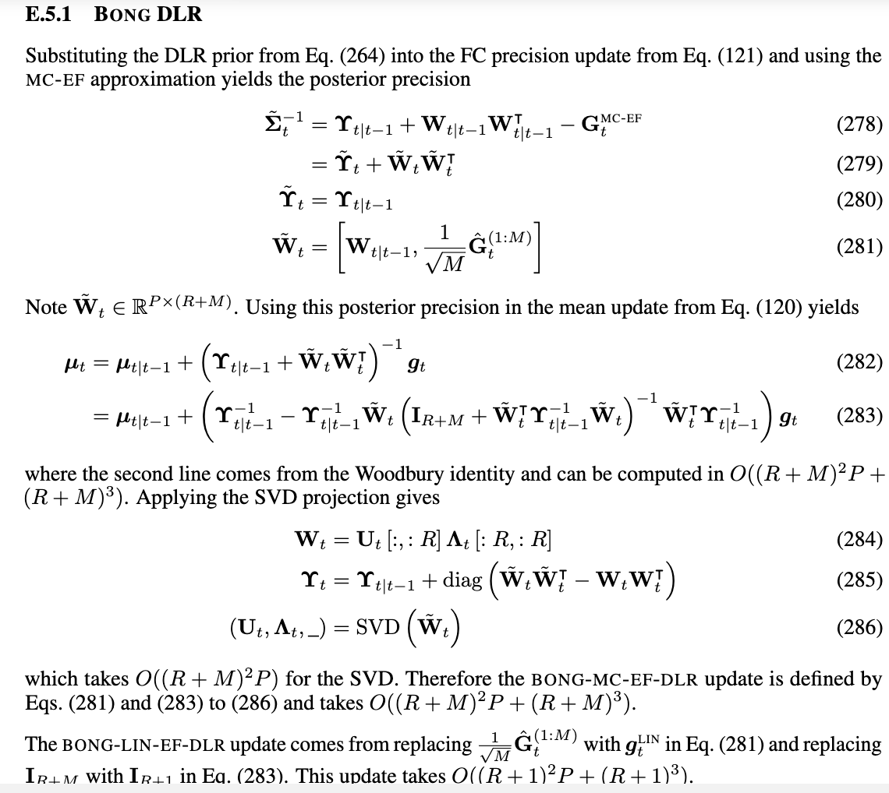
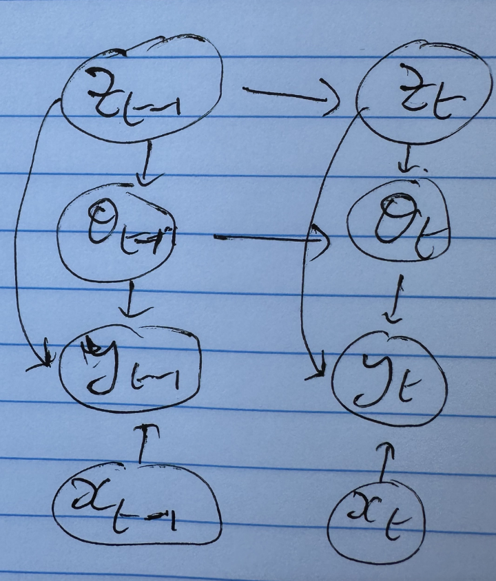
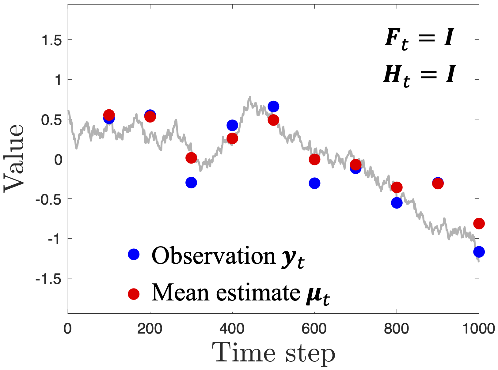

<!---
---

## LOFI in pictures

{style="max-width: 40%"}
-->

---
layout: two-cols
---

## Hierarchical Bayesian model

Switching State Space Model (SSM).

{style="max-width: 80%"}

::right::

Definitions

$$
x += 1
$$

<!--
---

## KF for denoising 1d signal

$y_t \sim N(\cdot|\theta, \sigma^2)$.

Plot $y_t$ and $E[\theta|y_{1:t}]$  vs $t$

{style="max-width: 50%"}
-->

---

## KF for tracking 2d object

$y_t \sim N(\cdot|\theta^{1:2}, \sigma^2 I)$.

Plot $p(\theta^{1:2}|y_{1:t}]$ for each step $t$.

{style="max-width: 50%"}

---

## Measurement (observation) model

Linear Gaussian model
$$
    p_t(y_t|\theta_t) = N(y_t|H_t \theta_t, R_t)
$$
where $R_t$ is the measurement/ observation noise.

Special case: Linear Regression ($H_t = x_t^\intercal$):
$$
    p(y_t|\theta_t, x_t) = N(y_t|x_t^\intercal \theta_t, R_t)
$$

Binary logistic Regression
$$
    p(y_t|\theta_t, x_t)
    = {\rm Bern}(y_t|\sigma(x_t^\intercal \theta_t))
$$

Multinomial logistic Regression
$$
    p(y_t|\theta_t, x_t)
    = {\rm Cat}(y_t|{\cal S}(\theta_t x_t))
$$

MLP classifier
$$
    p(y_t|\theta_t, x_t) = {\rm Cat}(y_t|{\cal S}
    (\theta_t^{(1)} \text{relu}(\theta_t^{(1)} x_t)))
= {\rm Cat}(y_t|h(\theta_t,x_t))
$$

{style="max-width: 20%"}

---

## BONG framework

- 4 update rules: (NGD or GD) x (Implicit reg. or KL reg)
- 4 gradient computations: (MC or Lin) x (Hess or EF)

$$
\begin{array}{lll} \hline
{\rm Name} & {\rm Loss} & {\rm Update} \\
{\rm BONG} & {\rm E[NLL]} & {\rm NGD} (I=1) \\
{\rm BOG} & {\rm E[NLL]} & {\rm GD} (I=1) \\	
{\rm BLR} & {\rm ELBO} & {\rm NGD (I>1)} \\
{\rm BBB} & {\rm ELBO} & {\rm GD} (I>1) \\	
\end{array}
$$

---

## BONG framework

- 4 update rules: (NGD or GD), (Implicit reg. or KL reg)
- 4 gradient computations: (MC or Lin), (Hess or EF)

{style="max-width: 50%"}

$$
\begin{aligned}
\psi_{t,i} &=
\psi_{t,i-1} + \alpha F_{\psi_{t|t-1}}^{-1}
\nabla_{\psi_{t,i-1}} L_t(\psi_{t,i-1}) \\
&=
\psi_{t,i-1} + \alpha 
\nabla_{\rho_{t,i-1}} L_t(\psi_{t,i-1}) \\
 L_t(\psi_{t,i}) &=
    E_{q_{\psi_{t,i}}}[\log p\left(y_{t} \vert h_{t}(\theta_{t})\right)]
    -KL(q_{\psi_{t,i}} | q_{\vpsi_{t\vert t-1}})
    \end{aligned}
$$

---
## Prediction: Misclassification (plugin) vs sample size (MNIST)

{style="max-width: 75%"}

---
## Calibration: ECE  vs sample size (BBB, BLR, BOG, BONG

{style="max-width: 75%"}

---
## BONG

